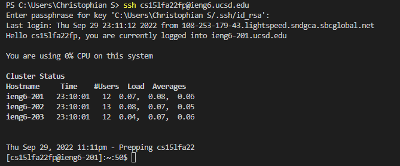

# **Week 1 Lab Report**
Hello, this is my week 1 lab report!

## Step 1: Installing Visual Studio Code:

So in here, I have installed visual studio code. To install VSC, you go to their website and follow the instructions given based on the operating system you use. In my case, it is Windowns.

## Step 2: Remotely Connecting:

In this step, we are connecting to the super computers of UCSD called ieng6. Firstly if you use windows like me, please install OpenSSH, if you use an OSX device, simply use your terminal. Type "ssh cs15lfa22xx@ieng6.ucsd.edu", where xx is the last 2 digits of your own account, to log in to ieng6 through your terminal. If they ask you about a fingerprint the first time you log in, type "yes".

## Step 3: Running Some Commands: 

For step 3, you simply want to play around with the commands. Me personally, I used ls, cd, and cat. The command ls just lists the files in your current directory, and the cd command changes your current directory to another, while the cat command outputs the content of a certain file inside your current directory.

## Step 4: Using the scp command to copy files over SSH

Here, I have lost the logs for when I actually used the SCP command, however the file I was supposed to copy is present in the screen shot above indicating I have done it. So what you want to do for this step is create a file called WhereAmI and paste the contents from the assignment page. After that, make sure it is in your desktop and use scp command to copy from your computer to the remote directory in ieng6. I used the command "scp WhereAmI.java cs15lfa22xx@ieng6.ucsd.edu:~/" 
P.S: Make sure you type this in your workstation and not ieng6!!

## Step 5: SSH Keys

Sadly, I didn't save the screenshot of me running the commands to activate my account without password, however saved a screenshot of proof that I could login to my ieng6 account without password and with a passphrase instead since I set one up. Basically, to do this step you'd want to use ssh-keygen and press enter when they ask you where to save the key (there are more steps for windows posted on the assignment page).

## Step 6: Optimizing your remote running:
