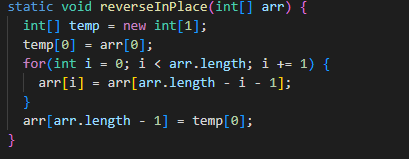

# **Week 3 Lab Report!** 
# *By Christophian Austin Sulaiman*
## Part 1:
Code block of my code of Search Engine:
```
import java.io.IOException;
import java.net.URI;
import java.util.*;

class Handler implements URLHandler {
    // The one bit of state on the server: a number that will be manipulated by
    // various requests.
    List<String> strings = new ArrayList<>();
    List<String> temp = new ArrayList<>();

    public String handleRequest(URI url) {
        temp.clear();
        
        if (url.getPath().equals("/")) {
            return String.format("The words you have up until now are: " + strings);
        } else if (url.getPath().equals("/search")) {
            String[] parameters = url.getQuery().split("=");
            if (parameters[0].equals("s")) {
                for (int i = 0; i < strings.size(); i++) {
                    if (strings.get(i).contains(parameters[1])) {
                        temp.add(strings.get(i));
                    }
                }
                return String.format("This is the list of words related to your search: " + temp);
            }
        } else if (url.getPath().equals("/add")) {
            String[] parameters = url.getQuery().split("=");
            if (parameters[0].equals("s")) {
                for (int cnt = 0; cnt < strings.size(); cnt++) {
                    if (strings.get(cnt).equals(parameters[1])) {
                        return String.format(parameters[1] + " is already in the list and won't be added again.");
                    }
                }
                strings.add(parameters[1]);
                return String.format("%s is successfully added to the list!", parameters[1]);
            }
        }
        return "404 Not Found!";
    
    }
}

class SearchEngine {
    public static void main(String[] args) throws IOException {
        if(args.length == 0){
            System.out.println("Missing port number! Try any number between 1024 to 49151");
            return;
        }

        int port = Integer.parseInt(args[0]);

        Server.start(port, new Handler());
    }
}
```

First Screenshot:

The methods in the code above that are called is the class "Handler" and method "handleRequest". As there is yet to be a path in the website screenshot above, the only thing being printed is an empty array as no words have been added yet. A relevant argument is the conditional statements used. the if statement filters out the path of the website and returns/direct it to its respective outputs. The path values have to be precise for it to run smoothly, otherwise will throw a 404 error.

Second screenshots:


The handleRequest function is responsible for this section of the code. For this section, the if statement regarding to the path "/add" plays a major role. As you can see from the screenshot, I added the word apple using the /add path and the word pineapple, which would give an output printed "apple/pineapple is successfully added to the list!". Aside from this, the arguments inside the if statement will add whatever word I added using the /add path to an array and store it, until it gets searched. The word that gets stored in is split within the query by "=". Furthermore, the code wouldn't allow the same string to be added, and will output "apple is already in the list and won't be added again."

Third screenshot:

The handleRequest function is again responsible for this section of the code. If the path is a "/search", the function splits up the words within the query again by "=". As shown in the screenshot, I have searched for "app". Inside the array, there is an "apple", "pineapple", and "banana". However, only apple and pineapple contain app in them, therefore the list of words returned contain both apple and pineapple but no banana. That is how the search section of the code operates. It will give an output of as many words inside the list that "contains" the string inside the search query.

## Part 2:
First bug from file "ArrayExamples.java":

* The method reverseInPlace:

    For the reverseInPlace failure-inducing input, I had the test run input {3, 4, 5, 2, 9}. The output was supposed to be {9, 2, 5, 4, 3}. The code of the test is given below:
    
     
    The symptom is at element [3]; the program expected <4> but was given <2>, leading to the test failure. 
    The failing test output screenshot is given below: 
    

    Turns out, the bug was that the original code did not have a temporary storage array for the first element of the array. Since the first element of array gets altered during the for loop, the last element of the array will not take the value of the original first array. Screenshot of the fixed code: 

    The connection between the symptom and the bug is that the symptom shown is that they expected <4> but was given <2>, and that's because the first element directly gets altered once the for loop runs, and so for the elements after it, if the element is involved with the first element, it will already use the new value of the first index element, which is why it returns the output with the symptom shown above. Since the bug causes the entire code to provide an incorrect ouput than expected, the symptom is related to the bug.

Second bug in the file "LinkedListExample":
 
 * The method append

    The failure inducing input for this method append, is that you must use the method a few times (2+) for it to execute the while loop. 

    

    The symptom was that the code threw a OutOfMemoryError. This could mean that the method ran its while loop infinitely, which would definitely cause an error and would not be able to run.

    ```
    testAppend(LinkedListTests)
    java.lang.OutOfMemoryError: Java heap space

    ```

    The bug in this code is that the (while) loop in the method checks for when n.next does not equal to null until the end of the linked list, then in the same loop it assigns the new value. This would add a new value during every loop or iteration that the while loop makes. On the other hand, what it should be doing is check for when n.next is not null since only the last node of the linked list would be null. This would iterate the code without an error. It also should add the new element out of the scope of the while loop. 

    

    As mentioned above, the bug, which is the fact that the while loop is set to run infinitely. This causes the symptom which is the error that gets thrown "OutOfMemoryError". For any input of that matter, the while loop would run infinitely which will always return the same error, as a code cannot run infinite times.
    


    


    